# AccessLab

A native Android app built with Jetpack Compose that demonstrates accessibility patterns aligned with EN 301 549 and WCAG 2.1 AA. It is simultaneously a **learning tool** (interactive quiz, notes, videos) and a **reference implementation** — every screen embodies intentional, standards-traceable accessibility decisions.

---

## Purpose

AccessLab lets users take an interactive quiz on EN 301 549 / WCAG 2.1 criteria, take notes, and watch curated videos — all while the app itself demonstrates the accessibility patterns it teaches. Every accessibility decision is intentional and traceable to a specific standard criterion.

---

## Screenshots

<table>
  <tr>
    <td align="center">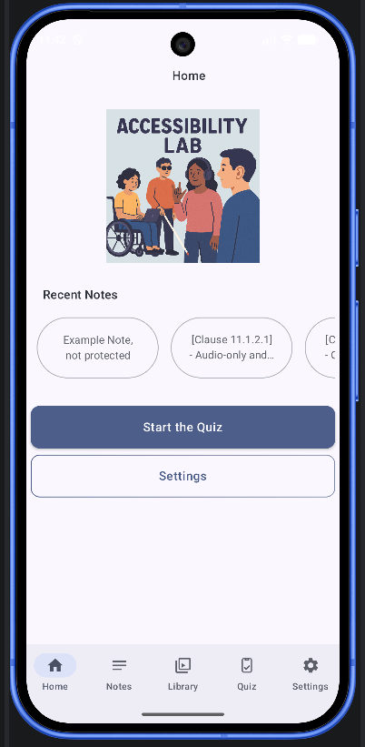<br/><sub>Home — light theme</sub></td>
    <td align="center">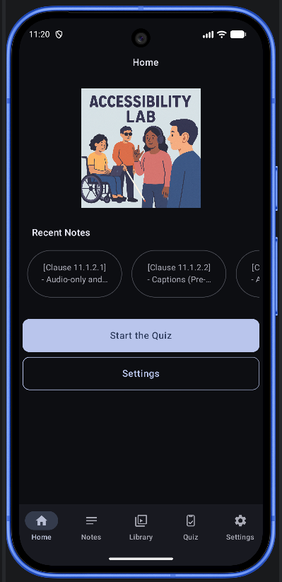<br/><sub>Home — dark theme</sub></td>
    <td align="center">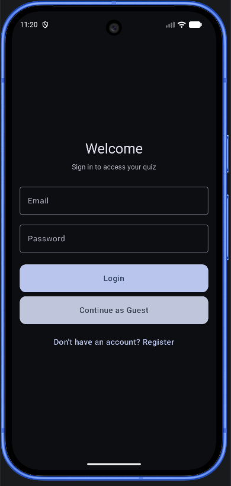<br/><sub>Login</sub></td>
  </tr>
  <tr>
    <td align="center">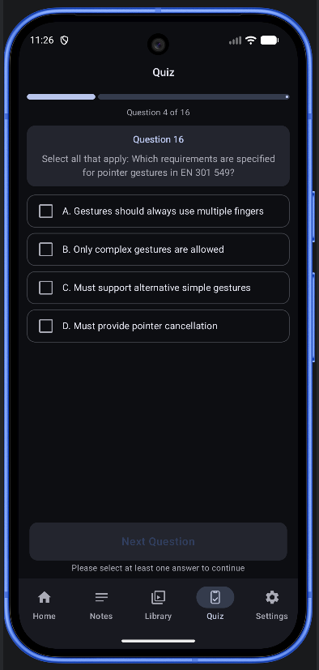<br/><sub>Quiz question</sub></td>
    <td align="center">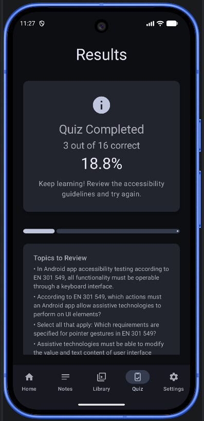<br/><sub>Quiz results — score and criteria to review</sub></td>
    <td align="center">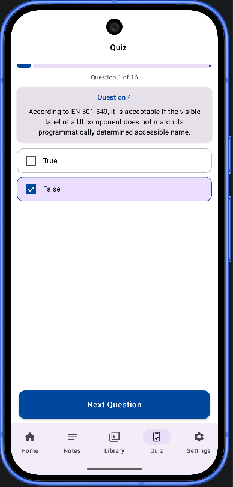<br/><sub>Quiz question — high-contrast theme</sub></td>
  </tr>
  <tr>
    <td align="center">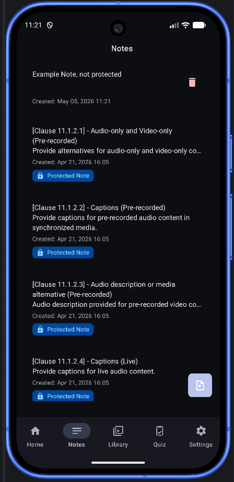<br/><sub>Notes list with clause tags and protected-note badges</sub></td>
    <td align="center">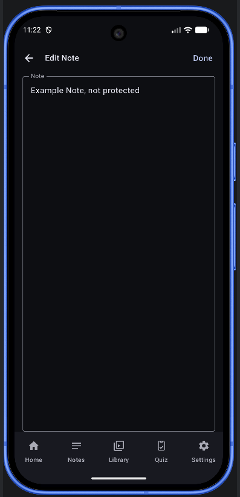<br/><sub>Note editing</sub></td>
    <td align="center">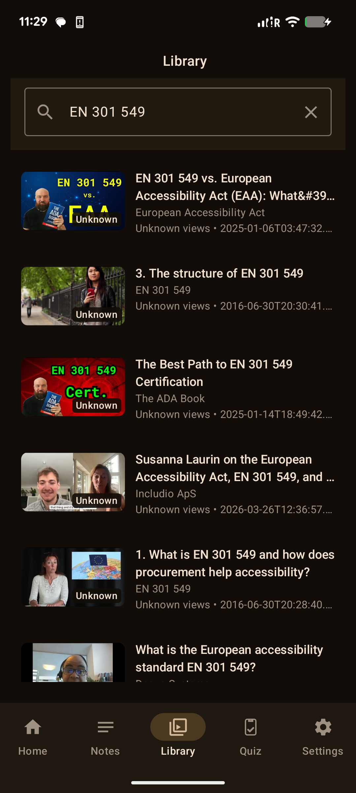<br/><sub>Video library — YouTube search results</sub></td>
  </tr>
  <tr>
    <td align="center">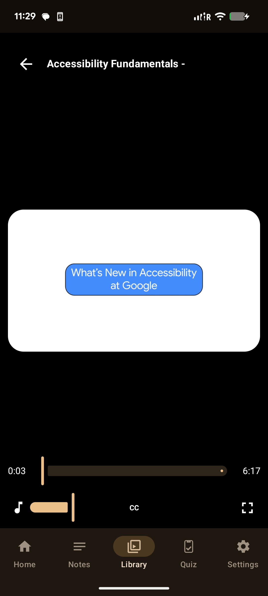<br/><sub>Video player — ExoPlayer with CC subtitle controls</sub></td>
    <td align="center">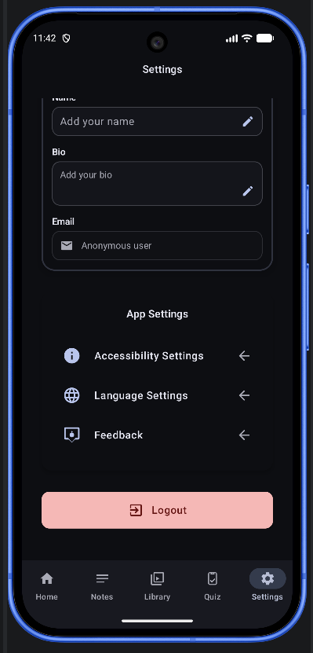<br/><sub>Settings hub</sub></td>
    <td align="center">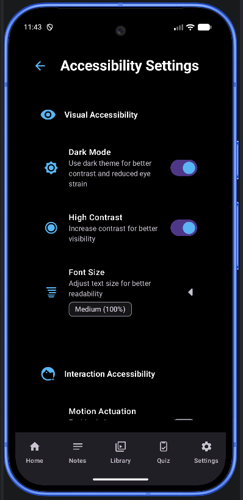<br/><sub>Accessibility settings — dark mode and high-contrast toggles</sub></td>
  </tr>
  <tr>
    <td align="center">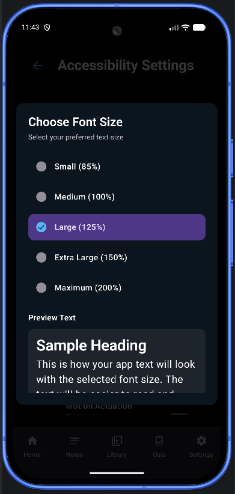<br/><sub>Font scale selector — 5 levels from 85 % to 200 %</sub></td>
    <td></td>
    <td></td>
  </tr>
</table>

---

## Tech Stack

| Layer | Libraries / versions |
|---|---|
| Language | Kotlin 2.x |
| UI | Jetpack Compose (BOM 2026.02), Material 3 |
| Architecture | Clean Architecture, MVVM, StateFlow |
| Auth | Firebase Authentication (email/password, anonymous) |
| Database | Room 2.8 + KSP |
| Networking | Retrofit 3, OkHttp 5 |
| Video | ExoPlayer / Media3 1.9, WebVTT subtitle parsing |
| Image loading | Coil 3 |
| Testing — automated | Compose UI Test + `ui-test-accessibility`, ATF via `espresso-accessibility` |
| Testing — static | Android Lint, custom `accessibility-lint-rules` module |
| Standards targeted | WCAG 2.1 AA, EN 301 549 Clause 11, BITV 2.0 |

---

## Architecture

```
app/src/main/
├── AccessLabApplication.kt      # Firebase init, language setup, Room seeding
├── MainActivity.kt              # Theme + accessibility settings entry point
│
├── core/                        # Pure Android utilities, no Compose dependency
│   ├── language/                # LanguageManager, LocaleAwareActivity
│   ├── sensors/                 # MotionSensorManager
│   └── util/                    # ImageStorageUtil, TimeUtils, UserDataStorageUtil
│
├── data/notes/                  # Room DAO, database, repository implementation
├── domain/notes/                # Use cases: add, delete, get, update notes
│
└── ui/                          # All Compose UI — feature-organised
    ├── auth/                    # LoginScreen, RegisterScreen, AuthViewModel
    ├── components/              # UnifiedButton, UnifiedTopBar, AccessibleFocusIndicator
    ├── home/                    # HomeScreen, NotesCarousel
    ├── media/                   # YouTube search, ExoPlayer, subtitle parsing
    ├── navigation/              # MainNavigation (bottom bar + NavigationRail)
    ├── notes/                   # NotesScreen, NoteEditScreen, NotesViewModel
    ├── quiz/                    # EN 301 549 quiz engine and results
    ├── settings/                # Settings, AccessibilitySettings, Language, Feedback
    ├── theme/                   # Color, Type, Theme, ThemeManager
    └── util/                    # AccessibilityUtils, ResponsiveUtils, Constants
```

---

## Features

- **Authentication** — email/password and anonymous login via Firebase Auth
- **Accessibility Quiz** — interactive questions covering EN 301 549 / WCAG 2.1 criteria with results screen
- **Notes** — full CRUD backed by Room, with TalkBack-friendly list and edit screens
- **Video Library** — YouTube API search with ExoPlayer playback and WebVTT subtitles
- **Accessibility Settings** — dark mode, high-contrast theme, 5-level font scale, reduced motion
- **Multi-language** — English and German (BITV 2.0)
- **Responsive layout** — phone portrait/landscape and tablet with NavigationRail

---

## Accessibility Implementation

### Color and Contrast

Three colour schemes are defined in `ui/theme/Color.kt`, each with documented contrast ratios:

| Theme | Normal text | Large text / UI components | Notes |
|---|---|---|---|
| Light | 4.5:1 (WCAG AA) | 3:1 | Blue 700, Grey 800, Green 800 on white |
| Dark | 4.5:1 (WCAG AA) | 3:1 | Blue 200, Grey 400, Green 500 on dark surface |
| High Contrast | 7:1+ (WCAG AAA) | 7:1+ | Blue 900; black-on-white pairs reach 21:1 |

Contrast ratios are also computed at runtime in `ui/util/AccessibilityUtils.kt` using the WCAG 2.1 relative luminance formula (sRGB linearisation → 0.2126R + 0.7152G + 0.0722B). Helper functions cover WCAG AA, WCAG AAA, and BITV 2.0 thresholds.

### Typography Scaling

Font scale is user-controlled via `ui/settings/FontScaleSelector.kt` with five levels:

| Level | Scale factor |
|---|---|
| Small | 0.85× |
| Medium (default) | 1.0× |
| Large | 1.25× |
| Extra-Large | 1.5× |
| Maximum | 2.0× |

Scale changes propagate reactively through `TypographyManager.getScaleState()` into `ui/theme/Theme.kt`, affecting all text styles app-wide. The system font scale is detected and mapped to the nearest app level via `AccessibilityUtils.getRecommendedFontScale()`.

### Semantic Structure

Every screen follows a consistent pattern:

- **Content descriptions** — all non-text elements and interactive controls carry `contentDescription` (133 string resources, prefixed `cd_*`)
- **Heading hierarchy** — `semantics { heading() }` on all section titles so screen readers can jump between sections
- **Role annotations** — `Role.Switch`, `Role.RadioButton`, `Role.Button` declared explicitly on every control type
- **TalkBack traversal order** — `semantics { traversalIndex }` used wherever visual order differs from logical reading order
- **Named regions** — navigation containers carry their own descriptions ("Bottom navigation bar", "Side navigation rail") so users know where they are

### Focus Management

`ui/components/AccessibleFocusIndicator.kt` wraps focusable content with a visible focus ring in one of three styles:

| Style | Border | Use case |
|---|---|---|
| `DEFAULT` | 2 dp, theme primary colour | Standard interactive elements |
| `HIGH_CONTRAST` | 3 dp, black or white (auto by luminance) | High-contrast mode; safety-critical controls |
| `COLORED` | 2 dp, theme tertiary colour | Decorative or secondary interactive areas |

The component detects the active colour scheme luminance (`ColorScheme.isLight`) and automatically selects `HIGH_CONTRAST` when high-contrast mode is enabled.

### Touch Targets

All interactive elements meet the 48 dp minimum specified by WCAG 2.5.5 and EN 301 549 §11.2.5.1:

- `UnifiedButton` enforces `Constants.Heights.BUTTON_STANDARD` (48 dp) as a hard minimum height
- Navigation items (bottom bar and rail) are validated by instrumented tests (see below)
- ATF checks in `NotesScreenAccessibilityComplianceATFTest` verify the FAB and action icons

### TalkBack and Assistive Technology

- Screen reader detection via `AccessibilityManager.getEnabledAccessibilityServiceList(FEEDBACK_SPOKEN)` — the app adapts certain UI states when a screen reader is active
- `AccessibilityManager.isEnabled()` used for broader AT detection (switches, voice access)
- Traversal index management ensures logical reading order independent of visual z-order

### Reduced Motion and Other Settings

`ui/settings/AccessibilitySettingsScreen.kt` exposes:

- **High-contrast mode** — switches the entire app to the high-contrast colour scheme
- **Font scale** — 5-level selector with live preview
- **Reduced motion** — disables non-essential transitions and animations

Settings are persisted and restored on startup via `AccessibilitySettingsViewModel`.

### Responsive and Adaptive Layout

- Phones in portrait/landscape: `BottomNavigationBar`
- Tablets in landscape: `NavigationRail` (wider tap targets, persistent labels)
- Adaptive spacing and font-size bumps via `ui/util/ResponsiveSpacing.kt`
- Maximum content widths: 400 dp (phone) → 1000 dp (large tablet)

---

## Accessibility Testing

### Tool Taxonomy

The project applies three evaluation methods:

| Method | Tool | Integration point | Coverage type |
|---|---|---|---|
| Automated | Android Lint (`accessibility-lint-rules/` module) | Gradle build / CI | Static — source and layout |
| Automated | Compose `ui-test-accessibility` | Instrumented test run | Runtime — Compose semantics tree |
| Automated | Accessibility Testing Framework (ATF) | Instrumented test run | Runtime — View/Compose UI hierarchy |
| Semi-automated | Espresso + `espresso-accessibility` | Instrumented test run | Runtime — interaction flows |
| Manual | TalkBack | On-device | Experiential — navigation, context, announcements |

### Lint Configuration

The `accessibility-lint-rules/` Gradle module is the home for lint configuration. The active rule set is declared in `app/valid-accessibility-lint.xml`, which enables and configures built-in Android lint rules relevant to accessibility (31 issues in total, including `ContentDescription`, `LabelFor`, `ClickableViewAccessibility`, `KeyboardInaccessibleWidget`, and RTL rules).

HTML, XML, and text lint reports are generated to `app/build/reports/`.

### Instrumented Test Infrastructure

`BaseAccessibilityComplianceTest` is the shared base class for all compliance tests. It provides:

- A `runTest(criterion, description) { }` wrapper that records pass/fail, execution time, and an optional recommendation on failure
- Text and JSON report generation written to external storage after each test run
- Aggregate metrics: total / passed / failed counts, compliance rate

Eight screen-level test classes extend this base:

| Test class | Screen |
|---|---|
| `LoginScreenAccessibilityComplianceTest` | Login |
| `RegisterScreenAccessibilityComplianceTest` | Register |
| `HomeScreenAccessibilityComplianceTest` | Home |
| `NotesScreenAccessibilityComplianceTest` | Notes (Compose semantics) |
| `NotesScreenAccessibilityComplianceATFTest` | Notes (ATF checks) |
| `QuizScreenAccessibilityComplianceTest` | Quiz |
| `SettingsScreenAccessibilityComplianceTest` | Settings |
| `NavigationAccessibilityComplianceTest` | Navigation bar / rail |

### EN 301 549 Criteria Coverage

Representative criteria tested by the instrumented suite:

| Criterion | Description | Test class |
|---|---|---|
| 11.1.1.1 | Non-text content — all images/icons have descriptions | `HomeScreenAccessibilityComplianceTest` |
| 11.1.3.1 | Info and relationships — list structure, heading roles | `NotesScreenAccessibilityComplianceTest` |
| 11.1.4.3 | Contrast (minimum) — 4.5:1 for normal text | `NotesScreenAccessibilityComplianceTest` |
| 11.2.1.1 | Keyboard / gesture operability | `NavigationAccessibilityComplianceTest` |
| 11.2.4.3 | Focus order — logical traversal sequence | `NavigationAccessibilityComplianceTest` |
| 11.2.5.1 | Touch target size ≥ 48 dp | `NotesScreenAccessibilityComplianceATFTest`, `NavigationAccessibilityComplianceTest` |
| 11.3.1.1 | Language of page — locale determinable | `NotesScreenAccessibilityComplianceTest` |
| 11.4.1.1 | Parsing — well-formed semantic markup | `NotesScreenAccessibilityComplianceTest` |
| 11.5.2.14 | Accessible names present on all controls | `NavigationAccessibilityComplianceTest` |
| 11.5.2.15 | Content section labels — named regions | `NavigationAccessibilityComplianceTest` |

### Running the Tests

```bash
# All instrumented accessibility tests (requires connected device or emulator)
./gradlew connectedAndroidTest

# Single test class
./gradlew connectedAndroidTest \
  -Pandroid.testInstrumentationRunnerArguments.class=\
com.makhabatusen.access_lab_app.ui.notes.NotesScreenAccessibilityComplianceTest

# Static lint (includes custom accessibility rules)
./gradlew lint
# Reports → app/build/reports/lint-results-debug.html
```

JSON compliance reports from the instrumented run are written to the device's external storage and can be pulled with `adb pull`.

---

## How to Build

### Prerequisites

- Android Studio Ladybug (2024.2) or newer
- JDK 17
- Android device or emulator running API 25+

### Steps

1. Clone the repository:
   ```bash
   git clone <repo-url>
   cd access_lab
   ```

2. Create `local.properties` in the project root (already gitignored) and add your YouTube Data API v3 key:
   ```
   sdk.dir=/path/to/your/Android/sdk
   YOUTUBE_API_KEY=your_key_here
   ```
   Get a key at [console.cloud.google.com](https://console.cloud.google.com) → APIs & Services → YouTube Data API v3.

3. Add your Firebase config file:
   ```
   app/google-services.json
   ```
   Create a Firebase project at [console.firebase.google.com](https://console.firebase.google.com), enable Authentication (Email/Password + Anonymous), and download `google-services.json` into the `app/` directory. See `app/google-services.json.template` for the expected structure.

4. Build and run:
   ```bash
   ./gradlew assembleDebug
   ```
   Or press **Run** in Android Studio.